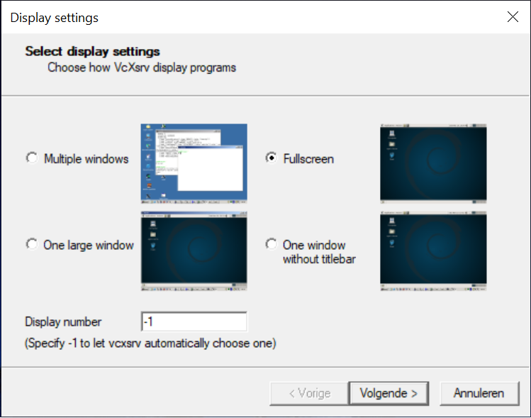

# Windows and Linux: A match made in Heaven!


<p align="center">

</p>


In this tutorial series we will show you how to create a desktop environment for
Ubuntu in the Windows Subsystem for Linux.
In fact, this guide has been written in it!
This tutorial will cover the installation of following programs.

1. Installing VcXsrv 
2. Install i3-gaps
3. Install neovim and ranger 

Begin by checking the version of your current Windows Subsystem for Linux, or by
installing it if it has not yet been installed. 
Open a command prompt and type the command
```shell
wsl -l -v
```

The output should be something along the lines of
```
  NAME            STATE           VERSION
* Ubuntu-18.04    Running         2
```

This guide does not work for version 1. 
If necessary, upgrade to version 2 before continuing.


Now that it is verified that the prerequisites are in place, let's start with
part one.

## Installing VcXsrv

Go to the following website [VcXsrv](https://sourceforge.net/projects/vcxsrv/)
and download, install VcXsrv. 
This installs xserver a window server that allows us to render the desktop for
the Ubuntu in the WSL. 

The first time you start it, Windows Firewall Defender will ask about the
firewall settings. *Make sure you tick the box on private networks!*
If this is not configured correctly, it will not allow VcXsrv to make a
connection to the WSL.
If you did not do this correctly, go to *configuration>system&security>windows
defender firewall* and click on "Allow application via Windows Defender
Firewalls" and add VcXsrv. 

Start XLaunch and configure it as below.  

<p align="center">



</p>

Lastly, save the configuration to your desktop and call it
`full_screen_config.xlaunch`.


On your desktop, create a powershell script called 
`launch.ps1` and add the following code to it. 

```powershell
start full_screen_config.xlaunch
ubuntu.exe run "~/.scripts/wlaunch"
```
**NOTE**: Check if the command ubuntu.exe works by running it in powershell. 
If you installed Ubuntu 18.04 the command is `ubuntu1804.exe` instead.

## Installing I3 

Next we install i3-gaps.

In the home directory create a folder called .scripts and a
folder called `.config`. These will hold all the configuration files and the
scripts. 

```
mkdir .config 
mkdir .scripts 
```

Then add the ppa containing `i3-gaps` and install it.

```
sudo add-apt-repository ppa:kgilmer/speed-ricer
sudo apt-get update
sudo apt install i3-gaps
```

Create a file called wlaunch and open it in nano (or any text editor).
This will be the startup script we will later create a shortcut from to start
the desktop from Windows.

```
cd .scripts
nano wlaunch
```
Then add the following lines.

```shell
#!/bin/bash

source ~/.bashrc 
export DISPLAY=$(awk '/nameserver / {print $2; exit}' /etc/resolv.conf 2>/dev/null):0

[[ -f ~/.Xresources ]] && xrdb -merge ~/.Xresources 

exec i3
```

Now in order to run it we need to make it executable and is accomplished via the command 

```
sudo chmod +x wlaunch
```

Now we test the solution by running the file `launch.ps1` 

## Install ranger, urxvt and neovim

As a last step we run the command 
```
sudo apt install ranger
sudo apt install neovim
sudo apt install rxvt-unicode
```

When you now run launch.ps1 you will be greeted with a black screen with the i3
status bar on the bottom of your window. 
If you hit Alt+Enter, a terminal screen will pop up. 

This is certainly not the prettiest sight and in the next tutorial we will begin 
creating a beautiful desktop environment. 
The fact that i3 is highly customizable also means we need to configure a lot.


